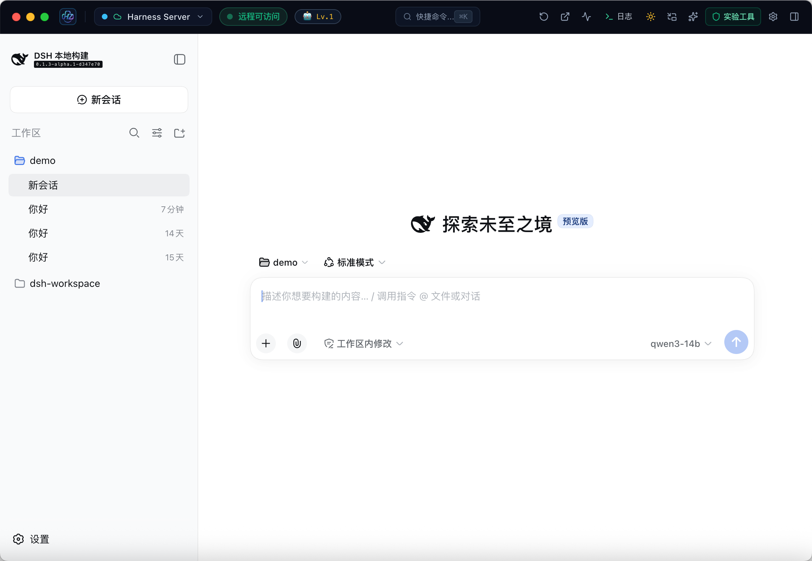
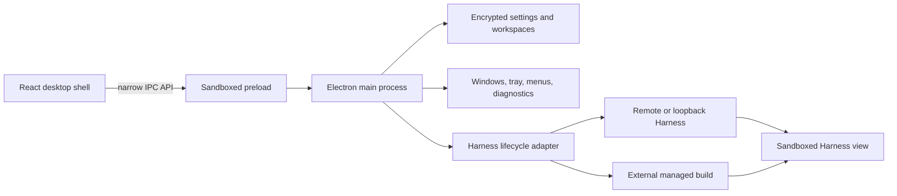

# HarnessFrame

**An independent, compatible, and detachable native desktop shell for DeepSeek Harness.**

`harnessframe-desktop` is designed for the **DeepSeek Harness** ecosystem with maximum compatibility and independence as its goals. It allows two product forms to coexist: the original standalone **Web/CLI experience** and the **native desktop client experience** supplied by HarnessFrame. DeepSeek Harness remains complete and independent, with its existing access and development workflows undisturbed, while HarnessFrame provides one native shell for macOS and Windows.

Let the desktop supervise a local Harness, attach to an existing instance, or switch to a new runtime build at any time. The desktop shell and Harness runtime remain decoupled and evolve independently.

[简体中文](README.zh-CN.md) · [Development](docs/development.md) · [Architecture](docs/architecture.md) · [Packaging](docs/packaging.md) · [Contributing](CONTRIBUTING.md) · [Code of Conduct](CODE_OF_CONDUCT.md)

**Related project: [DeepSeek Harness](https://github.com/deepseek-ai/deepseek-harness)**

> **Preview — `1.1.0-preview.1`.** Source code is available at [cu2mr/harnessframe-desktop](https://github.com/cu2mr/harnessframe-desktop). Preview binaries are not published yet. HarnessFrame is an independent community project and is not an official DeepSeek product.

## What HarnessFrame brings

### Two product forms, side by side

| Product form | How it is used | Relationship to Harness |
| --- | --- | --- |
| Standalone Web/CLI | Use the original DeepSeek Harness commands, browser entry point, and development workflow | Fully independent of HarnessFrame |
| Native desktop client | Use HarnessFrame in Managed or Attach mode | Connects to or supervises Harness externally without modifying upstream code |

DeepSeek Harness already supplies the agent runtime, Web interface, model routing, tools, and plugin graph. HarnessFrame adds a stable native boundary around it:



*A connected Harness workspace in the native desktop shell. HarnessFrame preserves the original Harness experience while adding desktop lifecycle, workspace, diagnostic, and navigation controls.*

- **Zero intrusion and independent operation.** HarnessFrame does not copy, fork, or modify `deepseek-harness`. Its existing Web and CLI access and development workflow remain fully intact, whether or not the desktop app is running.
- **Two desktop modes.** Managed mode starts an external `dsh web`, captures its token-bearing URL, monitors health, and safely stops only the process tree it owns. Attach mode connects to an existing loopback or remote HTTPS service without owning its lifecycle.
- **Runtime and shell evolve independently.** The default package contains no Harness engine. Upgrade or replace an external Harness build without rebuilding the Electron app.
- **Move between contexts quickly.** Save multiple workspaces and switch their service URL, working directory, port, badge, and desktop branding from one window.
- **A practical desktop surface.** Native menus and tray, service state, logs, diagnostics, detached and picture-in-picture views, workspace shortcuts, and deep links.
- **Safer configuration exchange.** Inspect before import, reject credentials and unsafe paths, back up overwritten files, and roll back failed writes where possible.
- **Security boundaries by default.** Sandboxed renderers, narrow preload APIs, trusted-sender IPC checks, blocked unexpected permissions, exact-origin navigation, encrypted settings when OS secure storage is available, and HTTPS for non-loopback services.
- **A base for community extensions.** Harness plugins remain in the Harness runtime; desktop features can grow around lifecycle, workspace, packaging, diagnostics, and native integration without modifying the upstream agent loop.

HarnessFrame is useful to different contributors for different reasons:

| Audience | Value |
| --- | --- |
| Harness users | One desktop entry point for multiple local or remote Harness workspaces. |
| Harness developers | Test a new source build behind the same desktop shell and switch back quickly. |
| Plugin authors | Exercise plugins in the full Harness UI while using desktop logs, lifecycle controls, and isolated workspaces. |
| Teams | Share reviewed workspace and preset bundles without exporting credentials. |
| Desktop contributors | Improve native UX, security, packaging, or platform support without forking the Harness core. |

## Simple by default, flexible when needed

### Attach to a running Harness

1. Open HarnessFrame.
2. Choose **Remote / Attach** mode.
3. Enter an HTTPS Harness URL, or an HTTP loopback URL such as `http://127.0.0.1:8080`.
4. Connect and save it as a workspace if you use it regularly.

New installations do not connect automatically. The loopback URL is a placeholder for a service you run; HarnessFrame does not provide a hosted service. Attach mode probes the service but never stops its external process.

### Run a local build in Managed mode

Build DeepSeek Harness using its own instructions, then point HarnessFrame at that checkout:

```sh
export DSH_HARNESS_PATH=/absolute/path/to/built-harness
pnpm run dev
```

The build must provide `apps/cli/lib/bin.js` and its runtime dependencies. HarnessFrame starts `dsh web`, detects the token-bearing URL announced by the process, monitors service health, and terminates only the process tree it owns.

### Replace or upgrade Harness

1. Build another Harness revision in a separate directory, or update the service behind a remote endpoint.
2. Change `DSH_HARNESS_PATH` / `harnessPath`, or select another remote workspace.
3. Restart the current connection.

No Harness source is copied into this repository and no desktop rebuild is required. “Hot-swappable” here means a replaceable runtime boundary with a short connection restart; it does not promise zero-downtime engine replacement or compatibility with every upstream revision.

## Platform status

| Platform | Status | Distribution target |
| --- | --- | --- |
| macOS Apple Silicon | Preview validation target; automated build and local smoke coverage | arm64 DMG / ZIP |
| Windows 10/11 x64 | Preview validation target; CI build configured, real-machine acceptance pending | x64 NSIS / portable |
| macOS Intel | Experimental; build script exists, acceptance pending | x64 DMG / ZIP |
| Windows arm64 | Experimental; not part of the initial release workflow | — |
| Linux | Not currently packaged or claimed as supported | — |

Managed startup, real authentication, Attach coexistence, restart and shutdown have been validated on macOS arm64 against an external build at Harness commit `d347e703908d0406b7a7ef80e3a0e594d86b2215`. See the [reproduction steps](docs/development.md#real-harness-acceptance) and their stated limits.

A successful build alone is not a support certification. Release readiness, signing, and manual validation are tracked in [release-readiness.json](release-readiness.json) and the [packaging guide](docs/packaging.md).

## Architecture



The separation is deliberate:

- **Desktop frame:** native lifecycle, windows, workspaces, security policy, diagnostics, packaging, and updates.
- **Harness runtime:** agent loop, models, tools, sessions, plugins, and the Web UI.
- **Configuration boundary:** reviewed bundles and redacted workspace metadata; credentials are never included in Preview imports or exports.

This makes upstream experimentation cheaper: a Harness revision can change without being vendored into the desktop repository, while desktop releases can improve native behavior without repackaging the agent framework. See the full [architecture notes](docs/architecture.md).

## Develop locally

Requirements: Node.js 24 recommended (minimum 22.18), pnpm 11.21.0, and macOS or Windows for the desktop UI.

```sh
pnpm install --frozen-lockfile
pnpm run electron:install
pnpm run dev
```

Useful checks:

```sh
pnpm run check
pnpm run audit:source
pnpm run source:snapshot
pnpm run package:mac:arm64
# On Windows:
pnpm run package:win:x64
```

Packaging never publishes automatically. See [development](docs/development.md) for runtime setup and data migration, and [packaging](docs/packaging.md) for signing and release controls.

## Grow the community

HarnessFrame is intended to be a shared desktop foundation rather than another private fork of the Harness:

- report reproducible connection, lifecycle, security, and packaging issues;
- contribute adapters and validation evidence for additional systems and architectures;
- improve workspace workflows, diagnostics, accessibility, localization, and native integration;
- document tested Harness revisions and plugin combinations;
- propose extension points before coupling desktop code to upstream internals.

Start with [CONTRIBUTING.md](CONTRIBUTING.md). Changes to credentials, IPC, process ownership, imports, and update logic should include regression evidence. Please keep secrets, personal configuration, and proprietary Harness bundles out of issues and pull requests.

## Current boundaries

- The default package does not bundle or download DeepSeek Harness.
- Enterprise SSO is not implemented. The DLP panel is a manual text-rule tester and does not intercept requests.
- Desktop updates open the configured release page; automatic installation is not implemented.
- Compatibility follows tested runtime contracts, not an assumption that every upstream commit works.

Settings use OS-backed encryption when available and keep a redacted public projection. Without secure storage, secrets stay in memory and must be entered again after restart. Read [SECURITY.md](SECURITY.md) before distributing configuration bundles.

## License

HarnessFrame source is available under the [MIT License](LICENSE). DeepSeek Harness, third-party packages, names, and artwork remain subject to their own licenses and trademark terms. Review [THIRD_PARTY_NOTICES.md](THIRD_PARTY_NOTICES.md) before publishing a release.
