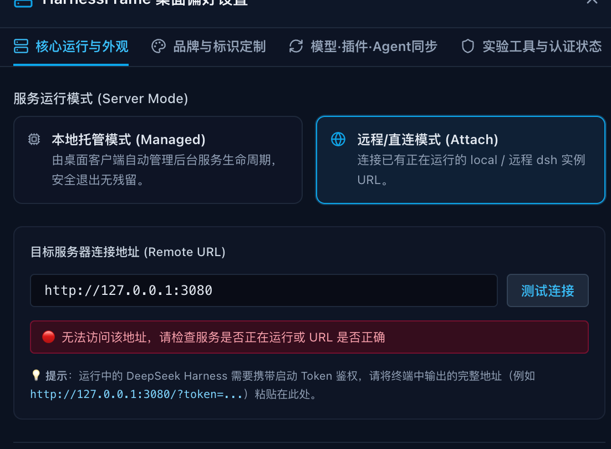
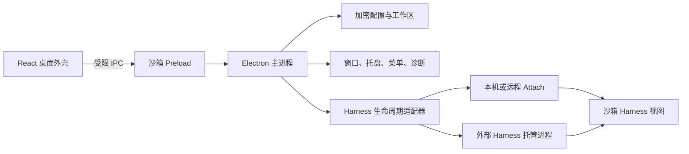

# HarnessFrame

**DeepSeek Harness 的独立、兼容、可插拔桌面客户端壳工程。**

`harnessframe-desktop` 旨在为 **DeepSeek Harness** 生态构建一套以最大化兼容性与独立性为目标的桌面客户端壳。它支持两种产品形态共存：DeepSeek Harness 原有的独立 **Web/CLI 模式**，以及 HarnessFrame 提供的 **桌面原生客户端模式**。在保持 `deepseek-harness` 完整独立、原有访问与开发方式不受干扰的前提下，为 macOS 与 Windows 提供统一的原生桌面封装。

你可以让桌面端自动托管本地 Harness、Attach 到已有实例，或随时切换到新版本；桌面外壳与 Harness 运行时始终解耦，各自独立演进。

[English](README.md) · [开发指南](docs/development.md) · [架构](docs/architecture.md) · [打包与发布](docs/packaging.md) · [参与贡献](CONTRIBUTING.md)

**友情链接：[DeepSeek Harness](https://github.com/deepseek-ai/deepseek-harness)**

> **Preview — `1.1.0-preview.1`。** 源码已发布于 [cu2mr/harnessframe-desktop](https://github.com/cu2mr/harnessframe-desktop)，预览安装包尚未发布。HarnessFrame 是独立的社区项目，不是 DeepSeek 官方产品。

## 核心亮点

### 双形态共存

| 产品形态 | 使用方式 | 与 Harness 的关系 |
| --- | --- | --- |
| 独立 Web/CLI | 按 DeepSeek Harness 原有命令、浏览器入口和开发流程使用 | 完全独立，不依赖 HarnessFrame |
| 桌面原生客户端 | 通过 HarnessFrame 的 Managed 或 Attach 模式使用 | 在外部连接或托管 Harness，不修改上游代码 |

1. **零入侵与独立运行**
   HarnessFrame 不复制、不 Fork、不修改 `deepseek-harness` 源码。Harness 仍然是完整、独立的上游项目，原有 Web/CLI 访问和开发方式 100% 保持不变。桌面端退出、升级或移除后，Harness 仍可按原方式运行和开发。

2. **桌面双模式**
   - **本地自动托管模式（Managed）**：启动外部构建好的 `dsh web`，识别其带 Token 的访问地址，完成连接与健康检查，并在退出时安全终止由当前桌面实例创建的进程树。
   - **直连/远程模式（Attach）**：连接已经运行的本机回环服务或远程 HTTPS 服务，不接管该服务的进程和生命周期。

3. **运行时可插拔更新**
   Harness 与桌面安装包各自演进。切换外部源码目录、构建版本或远程端点后，重新建立连接即可，无需把 Harness 合并进桌面仓库，也无需重新构建桌面端。

4. **使用简单，适配全面**
   同一个入口覆盖本地托管、本机 Attach、远程服务、多工作区、不同端口和自定义 Node 运行时；连接状态、日志和诊断集中在桌面端管理。

5. **原生桌面能力与安全边界**
   提供原生菜单、托盘、独立窗口、画中画、Deep Link、工作区快捷切换、配置导入检查与故障诊断。渲染进程沙箱化，非回环服务强制 HTTPS，敏感配置在系统安全存储可用时加密保存。

## HarnessFrame 带来了什么

DeepSeek Harness 已经提供 Agent 运行时、Web 界面、模型路由、工具和插件体系。HarnessFrame 在其外部增加桌面能力，不进入上游核心：



*Attach 模式不接管已有 Harness 进程。请粘贴 `dsh web` 输出的完整地址；截图中不会展示实际 Token。*

| 使用者 | 获得的价值 |
| --- | --- |
| Harness 用户 | 用一个桌面入口管理多个本地或远程工作区。 |
| Harness 开发者 | 在同一桌面外壳中快速验证不同 Harness 构建，并随时切回。 |
| 插件作者 | 保留完整 Harness UI 与插件机制，同时使用桌面日志、诊断和生命周期控制。 |
| 团队 | 共享经过检查的工作区和预设包，不导出凭据。 |
| 桌面贡献者 | 无需 Fork Harness 核心即可改进原生体验、安全、打包和平台适配。 |

## 快速使用

### 本地自动托管模式

按照上游说明构建 DeepSeek Harness，然后让 HarnessFrame 指向该目录：

```sh
export DSH_HARNESS_PATH=/absolute/path/to/built-harness
pnpm run dev
```

在设置中选择 **Managed**。构建目录需要包含 `apps/cli/lib/bin.js` 及其运行依赖。HarnessFrame 会启动等价于 `dsh web --no-open --port <port>` 的进程，自动接管启动输出中的鉴权 URL，并只管理自己创建的进程树。

### 直连/远程 Attach 模式

1. 打开 HarnessFrame，选择 **Remote**。
2. 本地服务填写完整回环地址，例如 `http://127.0.0.1:8080/?token=...`。
3. 远程实例填写 HTTPS 地址。
4. 连接后可保存为工作区，以便快速切换。

新安装不会自动连接。回环地址对应你已经运行的服务；HarnessFrame 不提供托管云服务。Attach 模式只连接和探测服务，不会停止外部进程。

### 替换或升级 Harness

1. 在独立目录构建另一个 Harness 版本，或更新远程端点背后的服务。
2. 修改 `DSH_HARNESS_PATH` / `harnessPath`，或选择另一个远程工作区。
3. 重新建立当前连接。

“热插拔”指可替换的运行时边界和短暂的连接重启，不表示零停机替换，也不承诺每个上游版本天然兼容。建议在问题报告中附上经过测试的 Harness commit。

## 平台支持

| 平台 | 当前状态 | 分发目标 |
| --- | --- | --- |
| macOS Apple Silicon | Preview 验收目标；已有自动构建和本地冒烟测试 | arm64 DMG / ZIP |
| Windows 10/11 x64 | Preview 验收目标；CI 已配置，等待真机验收 | x64 NSIS / portable |
| macOS Intel | 实验性支持；已有构建脚本，等待验收 | x64 DMG / ZIP |
| Windows arm64 | 实验性支持；暂不进入首发流程 | — |
| Linux | 当前未打包，也未声明支持 | — |

已在 macOS arm64 验证外部 Harness 构建（提交 `d347e703908d0406b7a7ef80e3a0e594d86b2215`）的托管启动、真实鉴权、Attach 共存、重启与退出；复现步骤见[开发指南](docs/development.md#real-harness-acceptance)。

编译成功不等于完成平台认证。发布状态、签名和人工验收记录在 [release-readiness.json](release-readiness.json) 与[打包指南](docs/packaging.md)中。

## 架构



- **桌面框架**：负责原生窗口、工作区、安全策略、诊断、生命周期、打包和更新入口。
- **Harness 运行时**：继续负责 Agent 循环、模型、工具、会话、插件和 Web UI。
- **连接边界**：Managed 模式管理自己创建的进程；Attach 模式只连接现有服务。
- **配置边界**：导入前检查并展示摘要；Preview 不导入或导出凭据。

这种分层让 Harness 可以高速演进，同时让桌面端独立改善原生体验。详细设计见[架构文档](docs/architecture.md)。

## 本地开发

建议使用 Node.js 24，最低版本为 22.18；pnpm 固定为 11.21.0。桌面运行环境为 macOS 或 Windows。

```sh
pnpm install --frozen-lockfile
pnpm run electron:install
pnpm run dev
```

常用检查：

```sh
pnpm run check
pnpm run audit:source
pnpm run source:snapshot
pnpm run package:mac:arm64
# Windows 环境：
pnpm run package:win:x64
```

本地打包不会自动发布。签名、实机验收、历史审查和 GitHub 配置见[打包指南](docs/packaging.md)。

## 共建社区

HarnessFrame 希望成为社区共享的桌面基础设施：

- 报告可复现的连接、生命周期、安全和打包问题；
- 提交更多系统、架构和 Harness 版本的验证结果；
- 改进工作区、诊断、无障碍、国际化和原生集成；
- 记录经过验证的 Harness commit 与插件组合；
- 在保持解耦的前提下扩展新的运行时适配器。

参与前请阅读 [CONTRIBUTING.md](CONTRIBUTING.md)。请勿在 Issue 或 Pull Request 中提交密钥、个人配置或专有 Harness 包。

## 当前边界

- 默认安装包不捆绑也不下载 DeepSeek Harness。
- 企业 SSO 尚未实现；DLP 面板是手动文本规则测试工具，不拦截请求。
- 桌面更新功能打开配置的发布页面，尚不自动安装。
- 兼容性以实际测试的运行时契约为准。

源码采用 [MIT License](LICENSE)。DeepSeek Harness、第三方依赖、名称和素材仍适用各自的许可证与商标条款。发布前请检查 [THIRD_PARTY_NOTICES.md](THIRD_PARTY_NOTICES.md)，安全问题见 [SECURITY.md](SECURITY.md)。
