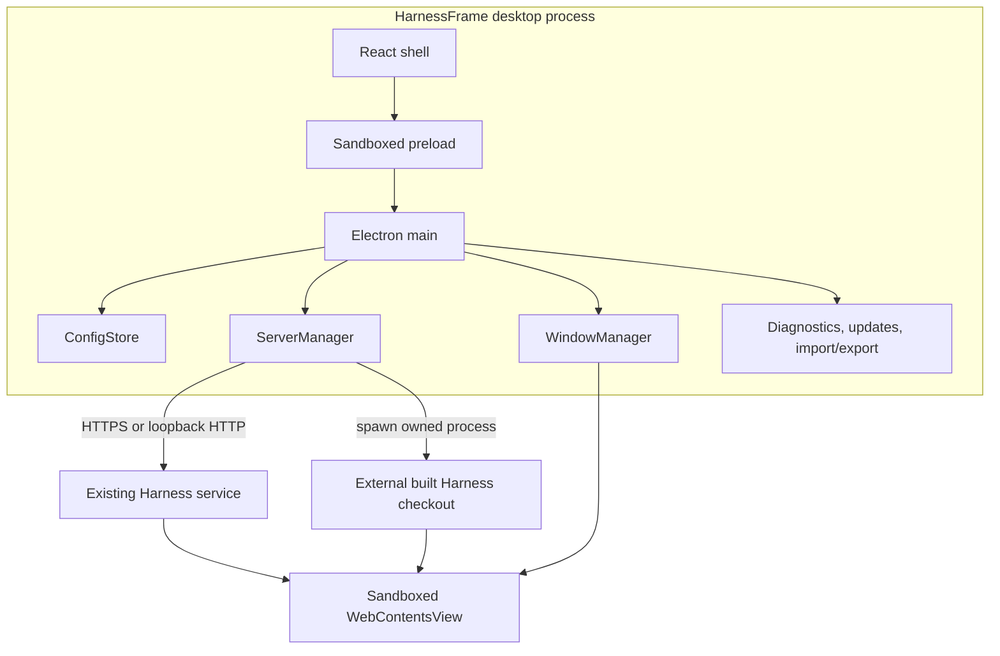

# HarnessFrame architecture

HarnessFrame is a desktop host around a separately evolving [DeepSeek Harness](https://github.com/deepseek-ai/deepseek-harness) runtime. Its architecture deliberately supports two coexisting product forms: standalone Harness Web/CLI operation and the HarnessFrame native desktop experience. The repository owns native lifecycle and policy; it does not vendor, fork, or modify the Harness agent loop, Web UI, model adapters, tools, sessions, or plugin graph. Existing Harness Web/CLI access and development workflows remain available independently of the desktop app.

## Runtime topology

| Layer | Owns | Does not own |
| --- | --- | --- |
| Desktop shell | Navigation, status, workspace selection, native controls | Agent behavior or model responses |
| Main process | IPC policy, configuration, process ownership, import/export, updates | Unrelated processes or upstream package management |
| Runtime adapter | Connect, health probe, start, stop, restart | Harness source or compatibility migration |
| Harness service | Agent loop, sessions, providers, tools, plugins, Web UI | Native desktop security policy |

## Replaceable runtime boundary

Attach mode stores an endpoint per workspace. Switching workspaces changes the active endpoint; non-loopback endpoints must use HTTPS. It probes an existing service without owning that service's lifecycle. Managed mode requires an explicit built checkout through `DSH_HARNESS_PATH` or `harnessPath`, looks for `apps/cli/lib/bin.js`, starts `dsh web`, captures the announced token-bearing URL, monitors health, and safely terminates only the process tree it created.

This boundary supports fast runtime replacement:

1. build another Harness revision outside this repository;
2. select its directory or a different remote workspace;
3. restart the current connection;
4. switch back if the revision is incompatible.

The desktop binary remains unchanged. A managed runtime restart is still required, and each runtime revision must be tested; the design does not create cross-version compatibility by itself.

## Security boundaries

The local React shell and pet window receive a narrow preload API. Harness pages, detached views, and picture-in-picture views run sandboxed without preload or Node.js integration. IPC handlers accept only trusted main-frame senders. Unexpected permission requests, new in-app windows, and cross-origin navigation are denied; validated external links open in the system browser.

`ConfigStore` writes a redacted JSON projection and, when Electron secure storage is available, an encrypted copy of full settings. Secrets remain available only to the trusted desktop process for authenticated connections. If secure storage is unavailable, secrets remain in memory and disappear on restart. These controls protect data at rest from accidental disclosure; they do not protect a compromised operating-system account.

## Process ownership

`ServerManager` either probes an existing service or launches the explicitly configured local engine. Managed startup requires a complete announced URL and an HTTP reachability check within 30 seconds; it never guesses a fallback endpoint. Reachability does not prove authentication. Startup failure stops the owned child and reports an error.

Shutdown signals only the child process tree started by the current HarnessFrame instance, waits for the child to close, escalates after five seconds, and reports failure if forced termination is not confirmed within another five seconds. Failed termination retains process ownership and blocks replacement. Lifecycle operations are serialized and stale health/output callbacks cannot modify a later connection. Application quit remains open with an error if shutdown fails. Diagnostics do not kill processes based on a command name or occupied port, so an unrelated Harness service remains outside the desktop lifecycle.

## Configuration boundary

Bundle parsing is bounded and validates the full payload before any mutation. Imports reject credentials, traversal, unsafe names, duplicate identities, invalid URLs and symlink targets. The user sees a warning before import; overwritten engine files are backed up and failed writes trigger best-effort rollback. This is a filesystem transaction aid, not a crash-safe database transaction. Plugins and presets can execute through Harness and must come from trusted sources.

## Extension seams

Current extension work should preserve these seams:

- **Runtime attachment:** add a transport or lifecycle adapter without moving agent logic into Electron.
- **Workspace profiles:** add metadata and connection behavior through validated workspace contracts.
- **Native capabilities:** menus, notifications, tray, window modes, diagnostics, and OS integration belong in the desktop frame.
- **Harness capabilities:** models, tools, skills, agents, and plugins remain upstream or runtime plugins.
- **Configuration distribution:** evolve the versioned bundle schema with validation, redaction, backup, and explicit user confirmation.
- **Platform packaging:** add an OS/architecture only with native CI, real-machine smoke evidence, signing documentation, and accurate support claims.

The repository builds independently. Electron Builder packages the desktop output and production dependencies; it does not copy a sibling Harness repository. Runtime installation, API credentials, service authentication, and upstream plugin trust remain explicit external responsibilities.
